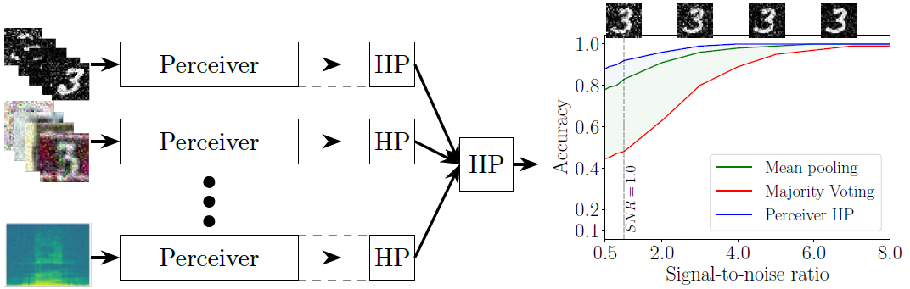

# MMMI Perceiver Hopfield Pooling
This repository contains the source code for the paper **Perceiver Hopfield Pooling for Dynamic Multi-Modal and Multi-Instance Fusion**.



## Run code with conda
The code was tested with Python=3.10 and CUDA version 11.3 on Ubuntu 20.04.4 LTS.

```
conda create --name perceiver_hp python=3.10
conda activate perceiver_hp
``` 

### Linux / Mac
``` 
pip install -r requirements.txt
``` 

### Windows
Download *hopfield-layers* repository outside of this repositories folder from: https://github.com/ml-jku/hopfield-layers (URL date: 07/10/2022)

Navigate to the cloned *hopfield-layers* folder and remove everything related to attribute **long_description** inside setup.py. The new setup.py file should like the following block.
```
import setuptools

setuptools.setup(
    name=r'hopfield-layers',
    version=r'1.0.2',
    author=r'Bernhard Schäfl',
    author_email=r'schaefl@ml.jku.at',
    url=r'https://github.com/ml-jku/hopfield-layers',
    description=r'Continuous modern Hopfield layers for Deep Learning architectures',
    long_description_content_type=r'text/markdown',
    packages=setuptools.find_packages(),
    python_requires=r'>=3.8.0',
    install_requires=[
        r'torch>=1.5.0',
        r'numpy>=1.20.0'
    ],
    zip_safe=True
)
```
Make sure that the build python package is installed:
```
pip install build
```

Inside the *hopfield-layers* folder:
``` 
python -m build
```

Switch to the repository (this) folder and
``` 
pip install -r requirements.txt
pip install <path_to_hopfield_layers_folder>\dist\hopfield-layers-x.x.x.tar.gz
``` 

## Run the paper example

Navigate to the repository folder/dataset_scripts

### Prerequisites
Make sure that *svn* (e.g. TortoiseSVN for Windows) is installed on your system. Restart Windows after you have installed the SVN tool. Make sure that svn is callable from the command line.

The alternative to downloading svn is to download the AudioMnist dataset manually.
If you want to download AudioMnist manually, download the data from: https://github.com/soerenab/AudioMNIST/tree/master/data to the **perceiver_hp** directory so that the structure looks like this:

perceiver_hp/datasets/audio_mnist/dataset/
- 01
- 02
- 03
- ...
- audioMNIST_meta.txt

The MNIST and SVHN dataset are downloaded using *wget* internally.

### Run

The following command downloads mnist and svhn (and audio mnist if not downloaded manually already) from online sources and creates data splits for all three modalities
``` 
python dataset_scripts/load_all.py
```

After downloading and splitting the data from all datasets, run the following command to execute the training for the Perceiver Hopfield Pooling model.
```
python src/perceiver_pooling/model.py
```

The model training execution automatically creates a tensorboard file inside the *runs* (created after training starts) directory.
You can open all model runs visualized by the following command:
```
tensorboard --logdir <repo_path>/runs
```

## Additional functionality
The directory *cvims* contains additional methods to apply [data transformations](https://github.com/cvims/perceiver_hp/cvims/data/transforms), e. g. to apply *Additive White Gaussian Noise* and *Random Noise*.
